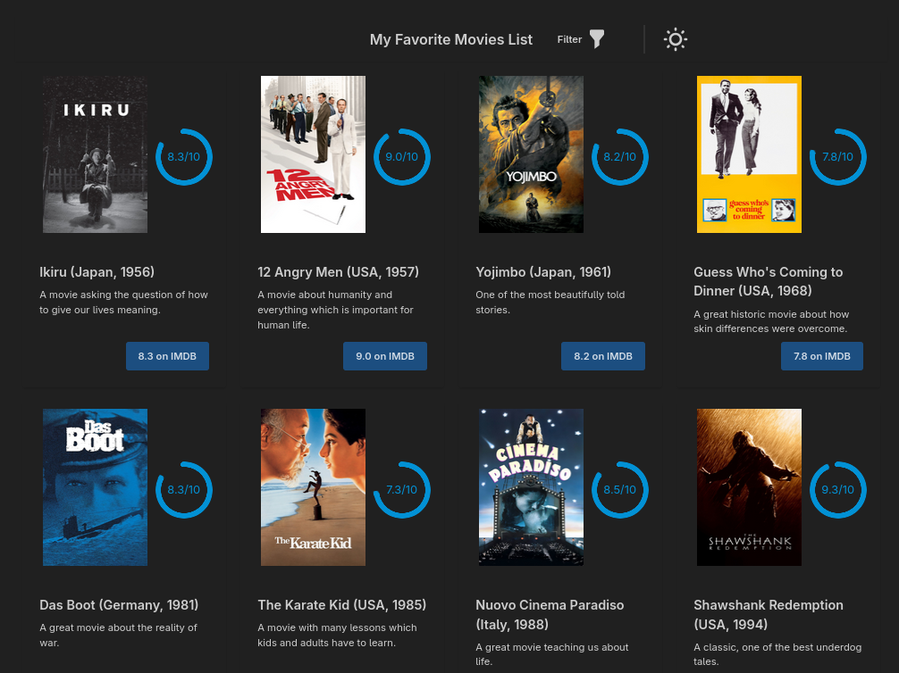
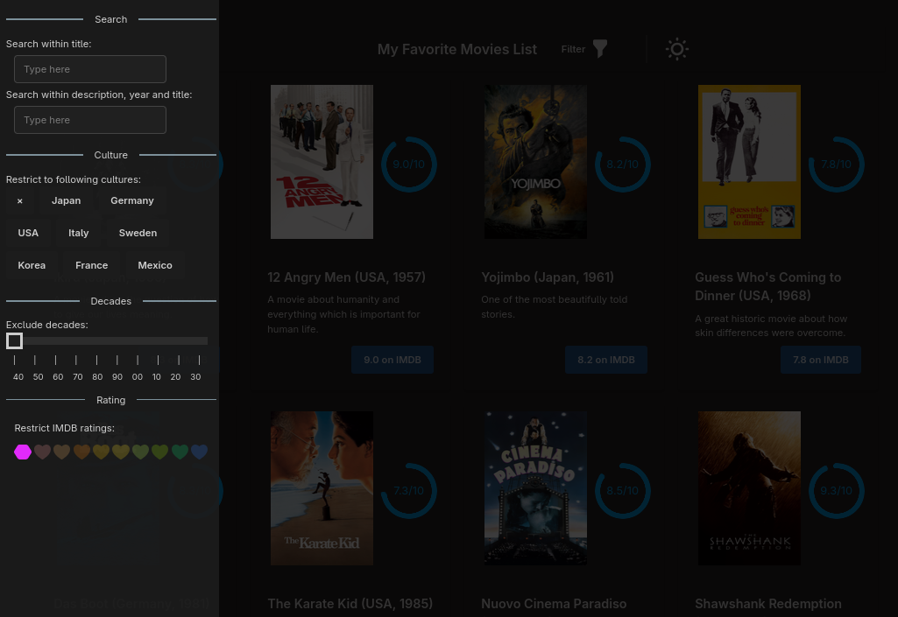

# My Movie DB

## Demo

|  |  |
|---|---|

## About

This project uses

  - Angular 21,
  - DaisyUI (tailwindCss + postcss).

Demo:

  - [Published demo](https://kraasch.github.io/demo_movie_db/) on Github Pages.

## Resources

Example pages:

  - [Thomann.de](https://www.thomann.de/intl/search.html?sw=piano+arius)

Links:

  - [Angular docs](https://angular.dev/guide/components/inputs)
  - [DaisyUI docs](https://daisyui.com/docs/install/angular/?lang=en)
    - component list: https://daisyui.com/components/

## Notes

DaisyUI does not provide a dual-handle slider.

  - alternative slider: https://github.com/danilo-znamerovszkij/daisy-dual-range/
    - demo: https://danilo-znamerovszkij.github.io/daisy-dual-range/
    - https://www.reddit.com/r/tailwindcss/comments/1qpmz2h/i_built_a_daisyuistyled_dual_range_minmax_slider/
